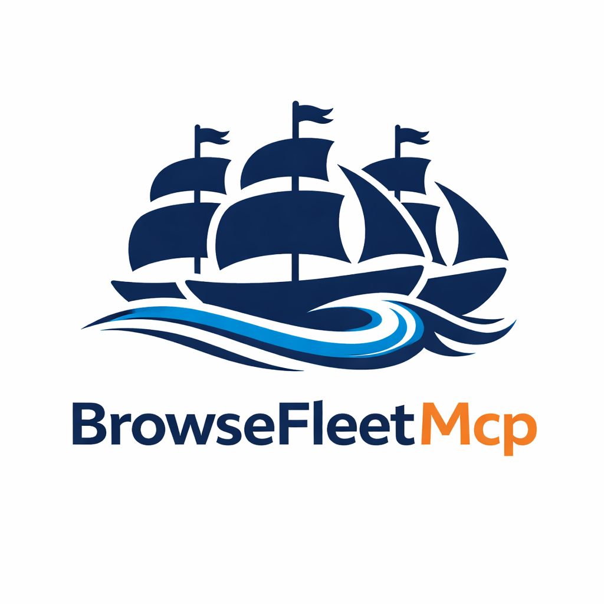

# BrowseFleetMCP

<p align="center">
  
</p>

BrowseFleetMCP is a local browser automation stack made of:

- a stdio MCP server in the repo root
- a Chrome extension in [`extension-v2/`](./extension-v2)

It is designed for parallel browser automation with isolated tab-to-window sessions, so multiple agents can control different browser windows without trampling each other.

Live docs: `https://jakubjdolezal.github.io/browsermcp/`

## Features

- Fast: automation happens locally on your machine.
- Private: browser activity stays on your device.
- Logged in: it uses your existing Chrome profile.
- Parallel: different MCP clients can lease different browser sessions.
- Inspectable: both the server and extension are plain TypeScript.

## How it works

The MCP server is a local stdio process that your client starts on demand. The Chrome extension connects browser tabs to the local broker over WebSocket so the MCP tools can drive the current session.

Important: client setup is only half of the installation. You also need to load the Chrome extension and connect a tab from the extension popup, otherwise browser tool calls will fail with `No connected tab`.

## Quick start

### 1. Build the MCP server

```bash
npm install
npm run build
```

### 2. Build the Chrome extension

```bash
cd extension-v2
npm install
npm run build
```

Then open `chrome://extensions`, enable Developer mode, click `Load unpacked`, and select [`extension-v2/`](./extension-v2).

### Port defaults and fallbacks

BrowseFleetMCP now prefers port `9150` for browser sessions, with backup ports `9152` and `9154`. That keeps the default setup separate from BrowserMCP's usual port.

You can also choose your own ports:

```bash
browsefleetmcp --port 9200 --fallback-ports 9202,9204
```

If you want to lock the local transport down, start the server with a shared token:

```bash
browsefleetmcp --auth-token your-shared-token
```

You can also set `BROWSEFLEETMCP_AUTH_TOKEN` in the environment instead of passing the token on the command line.

The extension popup exposes the same primary-port, backup-port, and auth-token settings, so you can point the extension at a custom local server without rebuilding it.

## CLI

BrowseFleetMCP already ships with a direct command-line interface. You do not need to go through an MCP client just to run the server:

```bash
browsefleetmcp
browsefleetmcp serve
browsefleetmcp --help
browsefleetmcp --version
```

Useful direct CLI examples:

```bash
browsefleetmcp --port 9200 --fallback-ports 9202,9204
browsefleetmcp --broker-port 9300 --broker-fallback-ports 9302,9304
browsefleetmcp --auth-token your-shared-token
```

If you are developing this repo locally, you can also run the built checkout directly:

```bash
node /absolute/path/to/browsermcp/dist/index.js
```

### 3. Add the MCP server to your client

Choose one of these launch modes:

- Published package:

```json
{
  "command": "npx",
  "args": ["-y", "browsefleetmcp"]
}
```

- Current local checkout:

```json
{
  "command": "node",
  "args": ["/absolute/path/to/browsermcp/dist/index.js"]
}
```

Use the published package if you want the npm release. Use the local checkout if you want your MCP client to run the code from this repo.

### 4. Connect a browser tab

Open any Chrome tab, click the BrowseFleetMCP extension popup, confirm the port settings, add the auth token if your server is using one, and connect the current tab. Once a tab is connected, MCP clients can call tools such as `browser_snapshot`, `browser_click`, and `browser_screenshot`. `browser_snapshot` is the simplified accessibility/navigation view, while `browser_screenshot` captures the rendered page as it actually looks in the browser.

If you connect multiple tabs, keep session management separate from browsing actions: use `browser_list_sessions` to inspect the available sessions, `browser_get_current_session` to see which session this MCP client is currently attached to, and `browser_switch_session` to move between them. The browsing and interaction tools no longer auto-pick a session for you. `browser_list_sessions` also reports how many distinct MCP clients touched each session in the last 5 minutes, so you can see which tabs have been active recently.

The input-driven tools `browser_click`, `browser_drag`, `browser_hover`, `browser_press_key`, and `browser_type` require focus. BrowseFleetMCP focuses the target window and serializes those actions behind one global focus lock so separate sessions do not steal focus from each other mid-action.

## Copy-ready examples

Ready-to-copy config files now live in [`examples/`](./examples):

- Codex: [`examples/codex/config.toml`](./examples/codex/config.toml)
- Cursor: [`examples/cursor/mcp.json`](./examples/cursor/mcp.json)
- Claude Code: [`examples/claude-code/mcp.json`](./examples/claude-code/mcp.json)
- Generic stdio clients: [`examples/generic/stdio.json`](./examples/generic/stdio.json)
- CLI: [`examples/cli/`](./examples/cli)

Each client also has a local-checkout variant that points directly at `dist/index.js` instead of `npx -y browsefleetmcp`.

## GitHub Pages docs

A standalone setup site now lives in [`docs/`](./docs):

- Site entrypoint: [`docs/index.html`](./docs/index.html)
- Install page: [`docs/install.html`](./docs/install.html)
- Client config page: [`docs/clients.html`](./docs/clients.html)
- CLI page: [`docs/cli.html`](./docs/cli.html)
- Claude Desktop page: [`docs/claude-desktop.html`](./docs/claude-desktop.html)
- Styles and interactions: [`docs/styles.css`](./docs/styles.css), [`docs/app.js`](./docs/app.js)
- Social preview assets: [`docs/assets/social-card.svg`](./docs/assets/social-card.svg), [`docs/assets/social-card.png`](./docs/assets/social-card.png)
- Custom domain template: [`docs/CNAME.example`](./docs/CNAME.example)
- Pages workflow: [`.github/workflows/pages.yml`](./.github/workflows/pages.yml)

If GitHub Pages is not already enabled for the repo, set the Pages source to `GitHub Actions`.

The default GitHub Pages URL for this repo is `https://jakubjdolezal.github.io/browsermcp/`.

## Add to Codex

Codex uses the same MCP configuration for the CLI and IDE extension.

### Codex CLI command

Published package:

```bash
codex mcp add browsefleet -- npx -y browsefleetmcp
```

Current local checkout:

```bash
codex mcp add browsefleet -- node /absolute/path/to/browsermcp/dist/index.js
```

Verify:

```bash
codex mcp list
```

### `~/.codex/config.toml`

Published package:

```toml
[mcp_servers.browsefleet]
command = "npx"
args = ["-y", "browsefleetmcp"]
```

Current local checkout:

```toml
[mcp_servers.browsefleet]
command = "node"
args = ["/absolute/path/to/browsermcp/dist/index.js"]
```

## Add to Cursor

Create `~/.cursor/mcp.json` on macOS/Linux and add:

Published package:

```json
{
  "mcpServers": {
    "browsefleet": {
      "command": "npx",
      "args": ["-y", "browsefleetmcp"]
    }
  }
}
```

Current local checkout:

```json
{
  "mcpServers": {
    "browsefleet": {
      "command": "node",
      "args": ["/absolute/path/to/browsermcp/dist/index.js"]
    }
  }
}
```

Restart Cursor after saving the file.

## Add to Claude Code

### Claude Code CLI command

Published package:

```bash
claude mcp add --transport stdio browsefleet -- npx -y browsefleetmcp
```

Current local checkout:

```bash
claude mcp add --transport stdio browsefleet -- node /absolute/path/to/browsermcp/dist/index.js
```

If you want the config shared in the repo, use `--scope project` and Claude Code will write a `.mcp.json` file in the project root.

### `.mcp.json`

Published package:

```json
{
  "mcpServers": {
    "browsefleet": {
      "command": "npx",
      "args": ["-y", "browsefleetmcp"]
    }
  }
}
```

Current local checkout:

```json
{
  "mcpServers": {
    "browsefleet": {
      "command": "node",
      "args": ["/absolute/path/to/browsermcp/dist/index.js"]
    }
  }
}
```

## Add to Claude Desktop

Claude Desktop now prefers MCP Bundles (`.mcpb`) for local servers. This repo includes a root `manifest.json` and `.mcpbignore` so you can package the current checkout as a desktop extension.

```bash
npm install -g @anthropic-ai/mcpb
npm run build
mcpb pack
```

Then in Claude Desktop:

1. Open `Settings > Extensions`.
2. Open `Advanced settings`.
3. Click `Install Extension...`.
4. Select the generated `.mcpb` file.

## Other MCP clients

BrowseFleetMCP is a standard stdio MCP server. Any client that can launch a local command with `command` plus `args` should work with one of these pairs:

Published package:

```json
{
  "command": "npx",
  "args": ["-y", "browsefleetmcp"]
}
```

Current local checkout:

```json
{
  "command": "node",
  "args": ["/absolute/path/to/browsermcp/dist/index.js"]
}
```

## Windows note

Some native Windows MCP clients cannot launch `npx` directly. If that happens, wrap it with `cmd /c`:

```json
{
  "command": "cmd",
  "args": ["/c", "npx", "-y", "browsefleetmcp"]
}
```

## Troubleshooting

- `No connected tab`: the extension is loaded, but no tab is connected yet.
- The MCP client starts but no browser tools work: reload the extension, reconnect a tab, and retry.
- You are developing this repo and your client still sees an old version: point the client at `node /absolute/path/to/browsermcp/dist/index.js` instead of `npx -y browsefleetmcp`.

## Local rebuild notes

This checkout also includes a clean Chrome extension implementation in [`extension-v2/`](./extension-v2). It keeps the existing MCP socket protocol, but removes the original single-tab runtime model:

- Each connected tab keeps its own WebSocket session to the local MCP server.
- Connecting a tab can move it into its own dedicated Chrome window for isolation.
- The local broker leases one browser session per MCP client, so concurrent agents do not contend for the same browser socket.
- Screenshot responses return full PNG image data instead of a resized preview image.
- A separate desktop screenshot tool can capture the current screen/window source through Chrome's picker.

## Credits

This project was originally adapted from the [Playwright MCP server](https://github.com/microsoft/playwright-mcp) so automation could run against the user's existing browser profile instead of spawning a separate browser instance.
